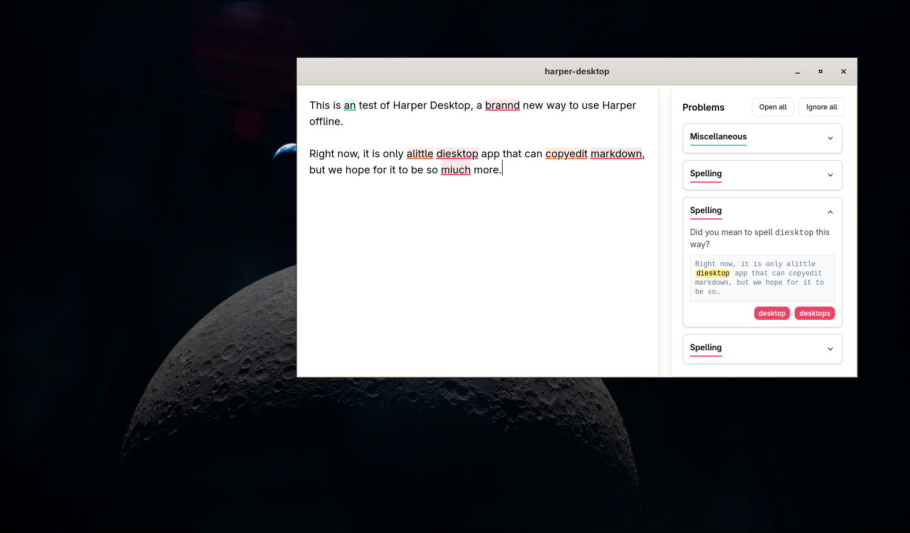

# Harper Desktop



> __NOTICE__: Documentation for Harper Desktop is incomplete. It will be updated on a "when we have time" basis. 

For context, see these posts:

- [Build A Harper Desktop App](https://elijahpotter.dev/articles/building-a-harper-desktop-app)

Right now, Harper Desktop does little more than serve as an offline editor for Markdown with the Harper grammar checker baked in.

## Recommended IDE Setup

[VS Code](https://code.visualstudio.com/) + [Svelte](https://marketplace.visualstudio.com/items?itemName=svelte.svelte-vscode) + [Tauri](https://marketplace.visualstudio.com/items?itemName=tauri-apps.tauri-vscode) + [rust-analyzer](https://marketplace.visualstudio.com/items?itemName=rust-lang.rust-analyzer).

## Building

Most actions needed to work on this repository are available via [`just`](https://github.com/casey/just).
Harper Desktop is part of the Harper monorepo and uses the root Cargo and pnpm workspaces.

To launch a development version of Harper Desktop with live reload, run:

```bash
just dev-desktop
```

To check the frontend and Rust targets, run:

```bash
just check-desktop
```

To build Linux bundles, run:

```bash
just build-desktop-linux
```
